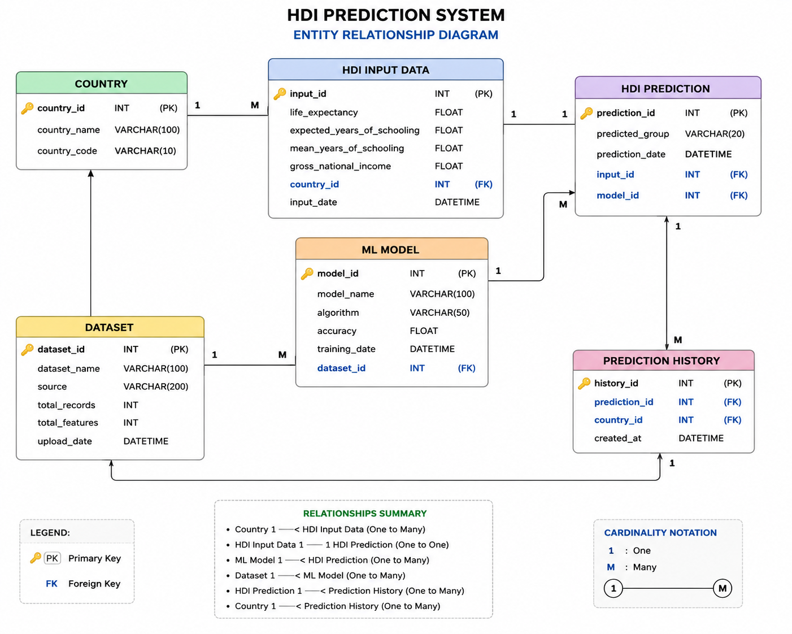
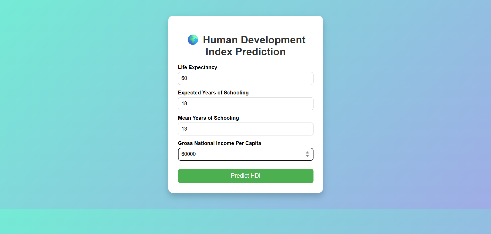
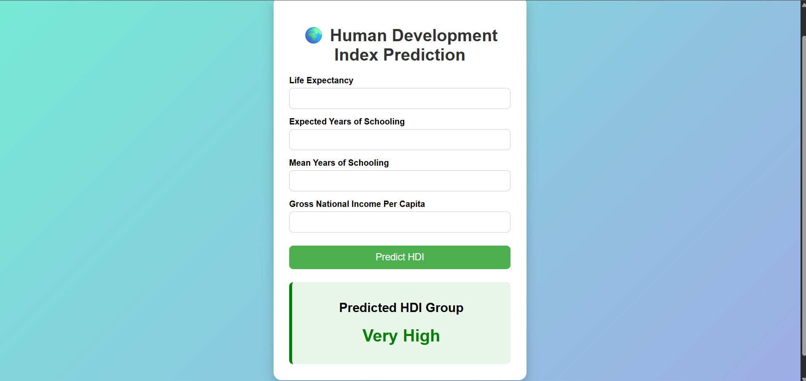

# 🌍 Human Development Index (HDI) Prediction

## 📌 Project Overview

This project predicts the **Human Development Group** of a country using **Machine Learning**. The prediction is based on four important development indicators:

* 🌱 Life Expectancy at Birth
* 🎓 Expected Years of Schooling
* 📚 Mean Years of Schooling
* 💰 Gross National Income (GNI) Per Capita

The application is built using **Python**, **Scikit-learn**, and **Flask**, providing a simple web interface where users can enter development indicators and instantly predict the corresponding Human Development Group.

---

# 🚀 Technologies Used

* Python 3.11
* Pandas
* NumPy
* Scikit-learn
* Flask
* Joblib
* HTML5
* CSS3

---

# 📂 Dataset

The dataset contains Human Development data for different countries.

### Features

* Life Expectancy at Birth (2021)
* Expected Years of Schooling (2021)
* Mean Years of Schooling (2021)
* Gross National Income (GNI) Per Capita (2021)

### Target

Human Development Groups:

* Low
* Medium
* High
* Very High

---

# 🤖 Machine Learning Model

### Algorithm Used

* Random Forest Classifier

### Model Accuracy

**94.87%**

---

# 🌐 Live Demo

### 🌍 Live Website

https://hdi-prediction-project.onrender.com/

### 🎥 Demo Video

https://drive.google.com/file/d/1XslzhMbz3xsZY69jkuh4jpzO8M3W1x6s/view?usp=sharing

### 💻 GitHub Repository

https://github.com/Ghani-5/HDI_Prediction_Project

---

# 📄 Project Documentation

The complete project documentation is available in the repository.

* 📘 documentation/Project_Documentation.pdf

---

# 📷 Screenshots

## Entity-Relationship Diagram



---

## Home Page



---

## Prediction Result



---

# 📋 Sample Prediction

| Feature                     | Value |
| --------------------------- | ----: |
| Life Expectancy             |    82 |
| Expected Years of Schooling |    18 |
| Mean Years of Schooling     |    13 |
| GNI Per Capita              | 60000 |

### Predicted HDI Group

**Very High**

---

# 📁 Project Structure

```text
HDI_PREDICTION_PROJECT/
│
├── app.py
├── train_model.py
├── requirements.txt
├── README.md
├── .gitignore
│
├── dataset/
│   └── hdi.csv
│
├── documentation/
│   └── Project_Documentation.pdf
│
├── templates/
│   ├── index.html
│   └── result.html
│
├── static/
│   └── style.css
│
├── screenshots/
│   ├── entity_relationship_diagram.png
│   ├── home_page.png
│   └── prediction_result.png
│
└── model/
    ├── model.pkl
    └── encoder.pkl
```

---

# ▶️ How to Run the Project

### 1. Clone the Repository

```bash
git clone https://github.com/Ghani-5/HDI_Prediction_Project.git
```

### 2. Navigate to the Project Directory

```bash
cd HDI_Prediction_Project
```

### 3. Install the Required Libraries

```bash
pip install -r requirements.txt
```

### 4. Run the Flask Application

```bash
python app.py
```

### 5. Open Your Browser

Visit:

```text
http://127.0.0.1:5000
```

or use the deployed application:

https://hdi-prediction-project.onrender.com/

---

# 📈 Output

The web application predicts one of the following Human Development Groups:

* Low
* Medium
* High
* Very High

---

# 📌 Future Improvements

* Improve the user interface.
* Add graphical analysis and interactive charts.
* Support HDI prediction for multiple years.
* Compare HDI predictions across different countries.
* Integrate real-time datasets from trusted sources.
* Deploy using Docker and cloud platforms for better scalability.

---

# 👨‍💻 Team Lead

**SHAIK GHAN SAIDA**

**Role:** Team Lead, Machine Learning Developer & Flask Application Developer

---

# 👥 Team Members

| Name                          | Role                                                     |
| ----------------------------- | -------------------------------------------------------- |
| **VIDYALATHA GORANTLA**       | Machine Learning Developer & Flask Application Developer |
| **REVANTH GAMINI**            | Machine Learning Developer & Flask Application Developer |
| **MALLAMPATI BHARADWAJ**      | Machine Learning Developer & Flask Application Developer |
| **SHAIK BOPPUDI ABDUL RAHIM** | Machine Learning Developer & Flask Application Developer |
